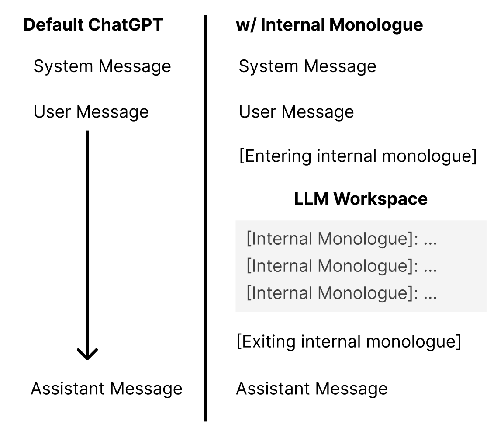

# Reasoners
Here we showcase a few tricks that leverage **internal monologue** to give us more direct control over the thinking process of LLMs. Heavily inspired by [SocialAGI](https://github.com/opensouls/SocialAGI).

## Internal Monologue
Internal monologue provides a workspace for LLMs to reason before responding. This allows the LLM to contruct explicit plans, consider more options than one, follow explicitly defined reasoning steps instead of simple inductive reasoning, etc...



## Objective-oriented Programming
Objective-oriented programming is a direct consequence of internal monologue, since it allows the LLM to explicitly reflect on its state. If we combine fuzzy reasoning abilities with discrete reasoning via function calling, we can unlock an entirely new state-based programming paradigm. The core idea is you can write code like this:

```python
reasoner.set_objective("do some task")
while not reasoner.objective_complete:
    # Insert planning step here!
    do_something()
    reasoner.evaluate_objective()
do_something_else()
```

Given this framework, as long as you can break down a complex task into a list of simpler tasks (objectives), an LLM has a much higher chance of completing the complex task.

## Structured Outputs
One of the biggest problems we ran into when constructing complex plans or trying to discretely control the action space of agents, was the lack of structured outputs. Reasoning in language is nice, but how do you convert the LLM's decisions into executable code?

One way to "force" structured outputs from LLM's is OpenAI's [function calling API](https://platform.openai.com/docs/guides/gpt/function-calling). However, instead of using the API for its intended purpose of outputting functions to call, we can leverage the trained JSON-formatted output abilities to output arbitrary data structures.

`structured.py` shows how to directly use function calling to output response according to a specific type, like a list of strings. `structured2.py` generalizes this to outputting an arbitrary pydantic BaseModel instance using some advanced psyoping strats. These ideas are further extended in [marvin](https://github.com/PrefectHQ/marvin) and [instructor](https://github.com/jxnl/instructor), but good luck figuring those out and making them work for your specific usecase.
